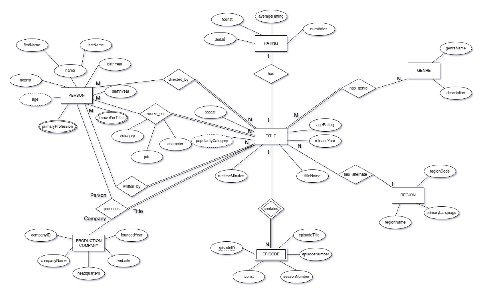
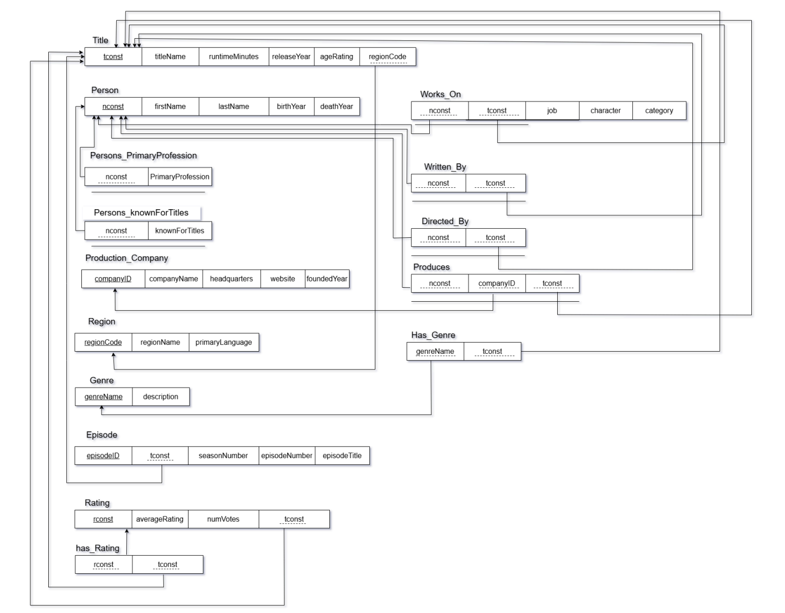
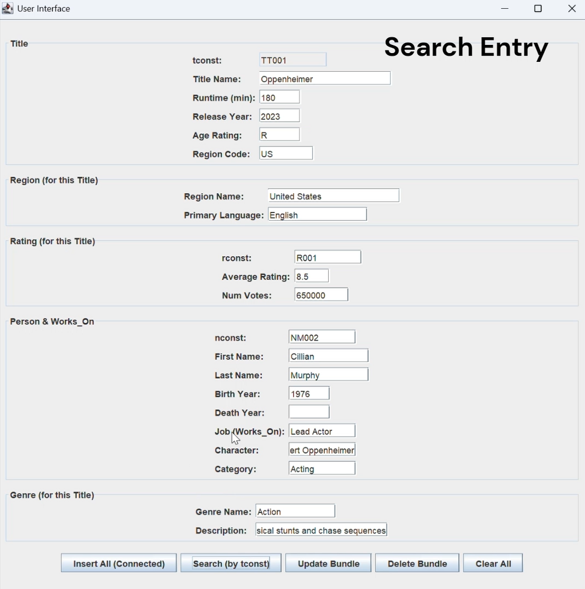
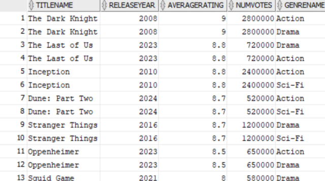

# IMDb Movie Database Management System

A relational database system for managing IMDb movie and TV data, built in Oracle SQL with a Java Swing GUI for querying without writing SQL. Covers the full database lifecycle: ER modeling, schema design, normalization, DDL implementation with constraints and triggers, analytical SQL queries, and a desktop interface on top.

## Overview

The system manages movies, TV series, episodes, people (actors, directors, writers, producers), production companies, regions, genres, and ratings. It captures complex relationships including ternary relationships (Person–Company–Title productions), many-to-many relationships (actors to titles, titles to genres), and multi-valued attributes (primary professions, known-for titles).

## Tech Stack

- **Database:** Oracle SQL
- **GUI:** Java Swing (NetBeans GUI Builder)
- **Design:** ER modeling, normalization, relational mapping

## Features

- 15+ normalized tables with foreign key constraints and check constraints
- Automated trigger to maintain referential integrity on rating inserts
- Ternary relationship modeling for multi-party production credits
- Weak entity handling for multi-valued attributes
- Analytical queries using JOINs, GROUP BY, and aggregations
- Java Swing desktop GUI for database querying without writing SQL

## ER Diagram



## Relational Schema



## Repository Structure

```
imdb-database-system/
├── README.md
├── sql/
│   ├── schema.sql          # DDL, inserts, and trigger
│   └── queries.sql         # Analytical queries
├── docs/
│   ├── ER-Diagram.png
│   ├── Relational-Schema.png
│   └── Report.pdf          # Full project report
├── gui/
│   └── (NetBeans project)
└── screenshots/
    ├── gui-main.png
    └── gui-query-results.png
```

## Example Queries

**1. Top-rated titles with their genres**
```sql
SELECT t.titleName, t.releaseYear, r.averageRating, r.numVotes, g.genreName
FROM Title t
JOIN Rating r ON t.tconst = r.tconst
JOIN Has_Genre hg ON t.tconst = hg.tconst
JOIN Genre g ON hg.genreName = g.genreName
WHERE r.averageRating >= 8.0
ORDER BY r.averageRating DESC, t.releaseYear DESC;
```

**2. Average rating and total votes by genre**
```sql
SELECT g.genreName,
       COUNT(DISTINCT t.tconst) AS numberOfTitles,
       ROUND(AVG(r.averageRating), 2) AS avgGenreRating,
       SUM(r.numVotes) AS totalVotes
FROM Genre g
JOIN Has_Genre hg ON g.genreName = hg.genreName
JOIN Title t ON hg.tconst = t.tconst
JOIN Rating r ON t.tconst = r.tconst
GROUP BY g.genreName
ORDER BY avgGenreRating DESC;
```

Full query set with sample results available in `sql/queries.sql` and the project report.

## GUI




The Java Swing GUI lets users explore the database through predefined views rather than writing SQL directly, making the data accessible to non-technical users.

## How to Run

1. Clone the repository:
   ```bash
   git clone https://github.com/MouazKass/imdb-database-system.git
   cd imdb-database-system
   ```
2. Run `sql/schema.sql` in Oracle SQL Developer (or any Oracle-compatible environment) to create tables and populate sample data.
3. Run queries from `sql/queries.sql` to explore the data.
4. Open the NetBeans project in the `gui/` folder to launch the desktop interface.

## Course Context

Developed as the semester project for CMP 320 (Database Systems) at the American University of Sharjah, Fall 2025.

## Team

- Mouaz Kassouma
- Mohammed Nour
- Yazan Alkazimi

Supervised by Dr. Mohammad Hamza.
